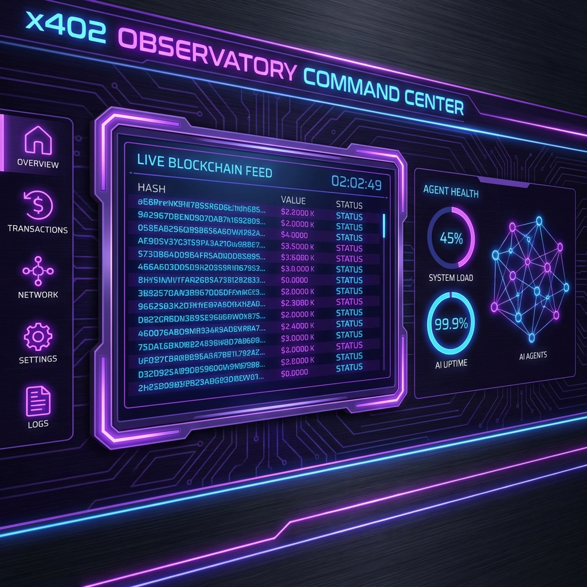
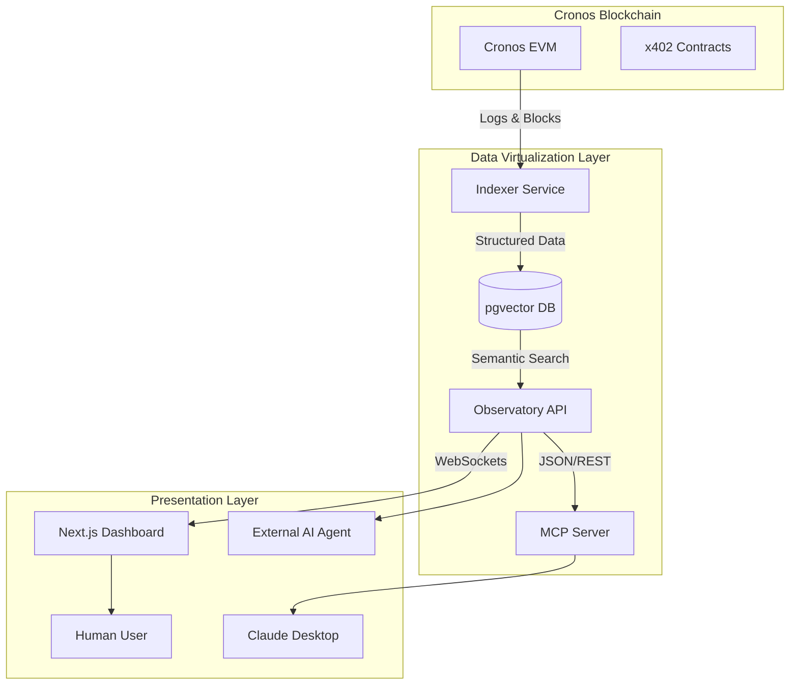

# 🔭 x402 Observatory

> **The Command Center for the Cronos Agentic Economy**
>
> *Live on Cronos EVM Mainnet*



<div align="center">

[](https://x402-agent-observatory-web.vercel.app/)
[](https://x402-observatoryapi-production.up.railway.app/api/v1/analytics/health)
[](LICENSE)

</div>

## 💡 The Problem
In the emerging **Agentic Economy** on Cronos, AI agents are performing autonomous transactions using **x402** standards. However, "Agents operate in the dark."

1.  **Invisibility**: Developers cannot see what their agents are doing in real-time.
2.  **No Standards**: There is no unified way to query agent behavior across different protocols.
3.  **Black Box**: "Why did my agent fail?" is a question with no easy answer.

## ⚡ The Solution: x402 Observatory
We built the **Google Analytics for AI Agents**. A unified "Data Virtualization Layer" that indexes, visualizes, and exposes agent activity via human-readable dashboards and **Machine-Readable APIs**.

### 🏆 Built for Track 4: Dev Tooling & Data Virtualization
We solve the "Data Virtualization" challenge by creating a unified indexing layer that turns raw EVM logs into structured "Agent Intent" data.

---

## 🌟 Key Features

### 1. 🧠 Natural Language Search (AI-Powered)
Don't write SQL. Just ask.
> "Show me all high-value payments from Agent Smith in the last 24h"

Our system uses **OpenAI Embeddings** to semantically index every transaction, allowing for "Vague Search" that understands intent.

### 2. 📊 Real-Time Control Tower
- **Live Transaction Feed**: Websocket-driven stream of every x402 interaction.
- **Agent Health Metrics**: Success rates, gas consumption analysis, and volume tracking.
- **Protocol Dominance**: See which DeFi protocols (VVS, Ferro, Moonlander) are being used by agents.

### 3. 🤖 MCP Server Integration (Agent-to-Agent)
We expose our entire dataset via the **Model Context Protocol (MCP)**.
- **Claude / ChatGPT Integration**: You can connect your local LLM directly to our Observatory.
- **Agent-Readable**: Your agents can query *us* to make decisions (e.g., "Is the network congested?").

---

## 🏗️ Architecture



## 🚀 Live Demo URLs

| Component | Status | URL |
|-----------|--------|-----|
| **Frontend Dashboard** | 🟢 Live | [https://x402-agent-observatory-web.vercel.app/](https://x402-agent-observatory-web.vercel.app/) |
| **API Endpoint** | 🟢 Live | [https://x402-observatoryapi-production.up.railway.app/](https://x402-observatoryapi-production.up.railway.app/) |
| **Health Check** | 🟢 Live | [Check API Health](https://x402-observatoryapi-production.up.railway.app/api/v1/analytics/health) |

---

## 🛠️ Tech Stack

- **Chain**: Cronos EVM Mainnet
- **Indexing**: Custom TypeScript Indexer + Ethers.js
- **Database**: PostgreSQL + `pgvector` (for semantic search)
- **AI/ML**: OpenAI `text-embedding-3-small` for transaction classification
- **API**: Express.js + Socket.io (Real-time feeds)
- **Frontend**: Next.js 14, TailwindCSS, Framer Motion, Recharts
- **Integration**: Model Context Protocol (MCP) SDK

## 📦 Local Installation

```bash
# Clone the repository
git clone https://github.com/your-username/x402-observatory.git

# Install dependencies
npm install

# Configure Environment
cp packages/api/.env.example packages/api/.env
# Add your CRONOS_RPC_URL and DATABASE_URL

# Start the Development Suite
npm run dev
```

## 🔮 Roadmap

- [ ] **Transaction Simulation**: Predict outcome before sending (using Tenderly API).
- [ ] **Alerting System**: Webhook notifications for specific agent failures.
- [ ] **Multi-Chain Support**: Expand to Cronos zkEVM.

---

### 💜 Built for Cronos x402 Paytech Hackathon 2026
*By the x402 Observatory Team h30s*
